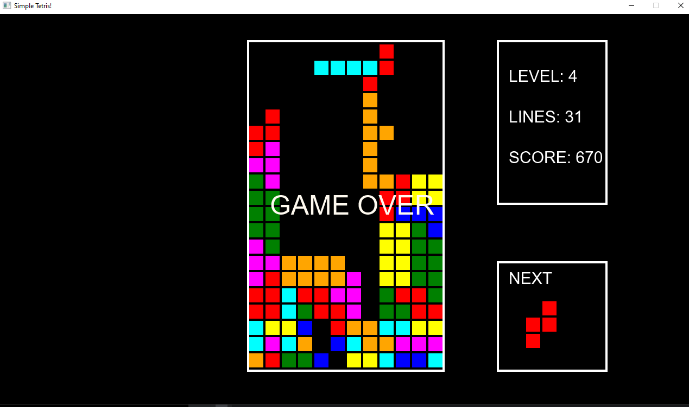

# tetris

Simple tetris game application made with JavaFX. 

Based on the following video https://www.youtube.com/watch?v=N1ktYfszqnM

## Controls
```
→/D = Move Mino to the right
←/A = Move Mino to the left
↑/W = Rotate Mino
↓/S = Move Mino down
[SPACE] = Pause/Resume game
```

## Screenshots


